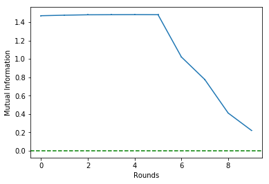
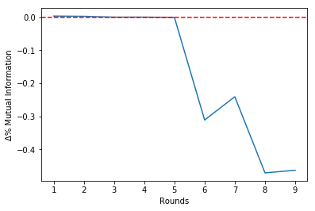
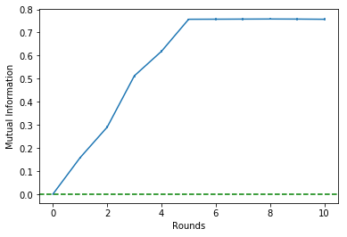
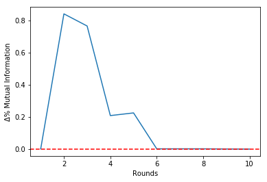

## Setup

import info_selection as inf


```python
!pip install git+https://github.com/felipemaiapolo/infosel.git#egg=infosel
```

    Collecting infosel
      Cloning https://github.com/felipemaiapolo/infosel.git to c:\users\felipe\appdata\local\temp\pip-install-qv0blqzu\infosel
    Requirement already satisfied: scipy in c:\users\felipe\appdata\local\programs\python\python35\lib\site-packages (from infosel) (1.1.0)
    Requirement already satisfied: numpy in c:\users\felipe\appdata\local\programs\python\python35\lib\site-packages (from infosel) (1.18.5)
    Requirement already satisfied: pandas in c:\users\felipe\appdata\local\programs\python\python35\lib\site-packages (from infosel) (0.22.0)
    Requirement already satisfied: sklearn in c:\users\felipe\appdata\local\programs\python\python35\lib\site-packages\sklearn-0.0-py3.5.egg (from infosel) (0.0)
    Requirement already satisfied: matplotlib in c:\users\felipe\appdata\local\programs\python\python35\lib\site-packages (from infosel) (2.0.0)
    Requirement already satisfied: pytz>=2011k in c:\users\felipe\appdata\local\programs\python\python35\lib\site-packages (from pandas->infosel) (2017.2)
    Requirement already satisfied: python-dateutil>=2 in c:\users\felipe\appdata\local\programs\python\python35\lib\site-packages (from pandas->infosel) (2.6.0)
    Requirement already satisfied: scikit-learn in c:\users\felipe\appdata\local\programs\python\python35\lib\site-packages (from sklearn->infosel) (0.22.2.post1)
    Requirement already satisfied: cycler>=0.10 in c:\users\felipe\appdata\local\programs\python\python35\lib\site-packages (from matplotlib->infosel) (0.10.0)
    Requirement already satisfied: pyparsing!=2.0.4,!=2.1.2,!=2.1.6,>=1.5.6 in c:\users\felipe\appdata\local\programs\python\python35\lib\site-packages (from matplotlib->infosel) (2.2.0)
    Requirement already satisfied: six>=1.10 in c:\users\felipe\appdata\local\programs\python\python35\lib\site-packages (from matplotlib->infosel) (1.15.0)
    Requirement already satisfied: joblib>=0.11 in c:\users\felipe\appdata\local\programs\python\python35\lib\site-packages (from scikit-learn->sklearn->infosel) (0.14.1)
    Building wheels for collected packages: infosel
      Building wheel for infosel (setup.py): started
      Building wheel for infosel (setup.py): finished with status 'done'
      Created wheel for infosel: filename=infosel-1.0.0-py3-none-any.whl size=7415 sha256=f8f45c68286cfcb7caaedbce3433262932898b21a6afff94e630bb6e0c2f943c
      Stored in directory: C:\Users\Felipe\AppData\Local\Temp\pip-ephem-wheel-cache-xxewlkql\wheels\20\b0\3a\4aa49eae8e1bece0f50df46ad7be724bc96544e5ba5e747380
    Successfully built infosel
    Installing collected packages: infosel
    Successfully installed infosel-1.0.0
    

    DEPRECATION: Python 3.5 reached the end of its life on September 13th, 2020. Please upgrade your Python as Python 3.5 is no longer maintained. pip 21.0 will drop support for Python 3.5 in January 2021. pip 21.0 will remove support for this functionality.
    WARNING: You are using pip version 20.2.3; however, version 20.2.4 is available.
    You should consider upgrading via the 'c:\users\felipe\appdata\local\programs\python\python35\python.exe -m pip install --upgrade pip' command.
    


```python
import infosel as inf
```


```python
import math
import numpy as np  
import pandas as pd
import random
import copy
import matplotlib.pyplot as plt
from sklearn import mixture
from sklearn.model_selection import train_test_split
from scipy.stats import multivariate_normal
```

Carregando pacotes e funções que utilizaremos


```python
#from .gmm import *
#from .mi import *
```


```python
from sklearn import mixture
from sklearn.model_selection import train_test_split

from select_vars_gmm.dataset_functions import *
```

Definindo função que será utilizada para selecionar o número de componentes nos GMM}

Carregando dois datasets que utilizaremos


```python
dataset_names=['cal_housing', 'fried_delve']
```


```python
data={}
for name in dataset_names: data[name]=download_dataset(name) 
```

    - *** cal_housing *** dataset shape= (20640, 9)
    - *** fried_delve *** dataset shape= (40769, 11)
    

Mantendo somente 15000 amostras


```python
for name in dataset_names: 
    n = data[name].shape[0]
    index = np.random.choice(n, min(15000,n), replace=False)
    data[name]=data[name].iloc[index,:]
```

Dividindo datasets em X e y


```python
for name in dataset_names: data[name]=get_X_y(data[name], scale=True)
```

## Exemplo 1: Regressão

Abrindo dataset


```python
X, y = data['fried_delve']

X.shape, y.shape
```


    ((15000, 10), (15000,))


Escolhendo número de componentes do GMM

O número ótimo de componentes é **k_star**. Fitando GMM final com k_star componentes


```python
%%time

gmm = inf.get_gmm(X, y)
```

    Wall time: 55.4 s
    

Fazendo a seleção de variáveis. O parâmetro **d_max** é o número máximo de variáveis que podemos selecionar e **stop** é o critério de parada. Por exemplo, se stop=0.01, então quando a melhora marginal de se selecionar uma variáveis é menor que 1%, em comparação ao nível passado, então o algoritmo para.


```python
select=inf.SelectVars(gmm, selection_mode = 'backward')
select.fit(X, y, eps=0, verbose=True)    
```

    Let's start...
    
    Round =   0   |   Î =  1.47   |   Δ%Î =  0.00   |   Features=[0, 1, 2, 3, 4, 5, 6, 7, 8, 9]
    Round =   1   |   Î =  1.48   |   Δ%Î =  0.00   |   Features=[0, 1, 2, 3, 4, 6, 7, 8, 9]
    Round =   2   |   Î =  1.48   |   Δ%Î =  0.00   |   Features=[0, 1, 2, 3, 4, 6, 8, 9]
    Round =   3   |   Î =  1.48   |   Δ%Î =  0.00   |   Features=[0, 1, 2, 3, 4, 6, 8]
    Round =   4   |   Î =  1.48   |   Δ%Î =  0.00   |   Features=[0, 1, 2, 3, 4, 8]
    Round =   5   |   Î =  1.48   |   Δ%Î = -0.00   |   Features=[0, 1, 2, 3, 4]
    Round =   6   |   Î =  1.02   |   Δ%Î = -0.31   |   Features=[0, 1, 3, 4]
    Round =   7   |   Î =  0.78   |   Δ%Î = -0.24   |   Features=[0, 1, 3]
    Round =   8   |   Î =  0.41   |   Δ%Î = -0.47   |   Features=[0, 3]
    Round =   9   |   Î =  0.22   |   Δ%Î = -0.46   |   Features=[3]
    


```python
select.get_info()
```


<div>
<style scoped>
    .dataframe tbody tr th:only-of-type {
        vertical-align: middle;
    }

    .dataframe tbody tr th {
        vertical-align: top;
    }

    .dataframe thead th {
        text-align: right;
    }
</style>
<table border="1" class="dataframe">
  <thead>
    <tr style="text-align: right;">
      <th></th>
      <th>rounds</th>
      <th>mi_mean</th>
      <th>mi_error</th>
      <th>delta</th>
      <th>num_feat</th>
      <th>features</th>
    </tr>
  </thead>
  <tbody>
    <tr>
      <th>0</th>
      <td>0</td>
      <td>1.469488</td>
      <td>0.007114</td>
      <td>0.000000</td>
      <td>10</td>
      <td>[0, 1, 2, 3, 4, 5, 6, 7, 8, 9]</td>
    </tr>
    <tr>
      <th>1</th>
      <td>1</td>
      <td>1.475040</td>
      <td>0.007019</td>
      <td>0.003778</td>
      <td>9</td>
      <td>[0, 1, 2, 3, 4, 6, 7, 8, 9]</td>
    </tr>
    <tr>
      <th>2</th>
      <td>2</td>
      <td>1.479532</td>
      <td>0.006955</td>
      <td>0.003045</td>
      <td>8</td>
      <td>[0, 1, 2, 3, 4, 6, 8, 9]</td>
    </tr>
    <tr>
      <th>3</th>
      <td>3</td>
      <td>1.480328</td>
      <td>0.006910</td>
      <td>0.000538</td>
      <td>7</td>
      <td>[0, 1, 2, 3, 4, 6, 8]</td>
    </tr>
    <tr>
      <th>4</th>
      <td>4</td>
      <td>1.481190</td>
      <td>0.006890</td>
      <td>0.000582</td>
      <td>6</td>
      <td>[0, 1, 2, 3, 4, 8]</td>
    </tr>
    <tr>
      <th>5</th>
      <td>5</td>
      <td>1.480481</td>
      <td>0.006870</td>
      <td>-0.000479</td>
      <td>5</td>
      <td>[0, 1, 2, 3, 4]</td>
    </tr>
    <tr>
      <th>6</th>
      <td>6</td>
      <td>1.020320</td>
      <td>0.006416</td>
      <td>-0.310819</td>
      <td>4</td>
      <td>[0, 1, 3, 4]</td>
    </tr>
    <tr>
      <th>7</th>
      <td>7</td>
      <td>0.775063</td>
      <td>0.006109</td>
      <td>-0.240372</td>
      <td>3</td>
      <td>[0, 1, 3]</td>
    </tr>
    <tr>
      <th>8</th>
      <td>8</td>
      <td>0.410130</td>
      <td>0.005734</td>
      <td>-0.470843</td>
      <td>2</td>
      <td>[0, 3]</td>
    </tr>
    <tr>
      <th>9</th>
      <td>9</td>
      <td>0.220244</td>
      <td>0.004198</td>
      <td>-0.462989</td>
      <td>1</td>
      <td>[3]</td>
    </tr>
  </tbody>
</table>
</div>


Das 8 variáveis originais, selecionamos 6. Vamos ver quais são essas 6:

Plotando informação mútua com erro padrão:


```python
select.plot_mi()
select.plot_delta()
```








Podemos ainda pegar os dados que geraram o gráfico... a tupla volta as informações mútuas e desvios-padrão


```python
X_new = select.transform(X, rd=4)

X_new.shape
```


    (15000, 6)


## Exemplo 2: Classificação

Abrindo dataset


```python
X, y = data['fried_delve']

X.shape, y.shape
```


    ((15000, 10), (15000,))


Transformando label quantitativo em categórico


```python
ind0 = (y<np.percentile(y, 33))
ind1 = (np.percentile(y, 33)<=y) & (y<np.percentile(y, 66))
ind2 = (np.percentile(y, 66)<=y)

y[ind0] = 0
y[ind1] = 1
y[ind2] = 2

y=y.astype(int)
```

Para cada classe vamos fitar um GMM. Por conta disso, criaremos um dicionário de GMMs


```python
%%time 

gmm=get_gmm(X, y, y_cat=True)
```

    Wall time: 46.9 s
    

Fazendo seleção. Ao contrário do caso da regressão, oferecemos ao algoritmo um dicionário de GMMs ao invés de um modelo único:


```python
select=SelectVars(gmm, selection_mode='forward')
select.fit(X, y, verbose=True, eps=0)    
```

    Let's start...
    
    Round =   0   |   Î =  0.00   |   Δ%Î =  0.00   |   Features=[]
    Round =   1   |   Î =  0.16   |   Δ%Î =  0.00   |   Features=[3]
    Round =   2   |   Î =  0.29   |   Δ%Î =  0.84   |   Features=[3, 0]
    Round =   3   |   Î =  0.51   |   Δ%Î =  0.77   |   Features=[3, 0, 1]
    Round =   4   |   Î =  0.62   |   Δ%Î =  0.21   |   Features=[3, 0, 1, 4]
    Round =   5   |   Î =  0.76   |   Δ%Î =  0.22   |   Features=[3, 0, 1, 4, 2]
    Round =   6   |   Î =  0.76   |   Δ%Î =  0.00   |   Features=[3, 0, 1, 4, 2, 6]
    Round =   7   |   Î =  0.76   |   Δ%Î =  0.00   |   Features=[3, 0, 1, 4, 2, 6, 8]
    Round =   8   |   Î =  0.76   |   Δ%Î =  0.00   |   Features=[3, 0, 1, 4, 2, 6, 8, 9]
    Round =   9   |   Î =  0.76   |   Δ%Î = -0.00   |   Features=[3, 0, 1, 4, 2, 6, 8, 9, 7]
    Round =  10   |   Î =  0.76   |   Δ%Î = -0.00   |   Features=[3, 0, 1, 4, 2, 6, 8, 9, 7, 5]
    


```python
select.plot_mi()
select.plot_delta()
```








```python
select.get_info()
```


<div>
<style scoped>
    .dataframe tbody tr th:only-of-type {
        vertical-align: middle;
    }

    .dataframe tbody tr th {
        vertical-align: top;
    }

    .dataframe thead th {
        text-align: right;
    }
</style>
<table border="1" class="dataframe">
  <thead>
    <tr style="text-align: right;">
      <th></th>
      <th>rounds</th>
      <th>mi_mean</th>
      <th>mi_error</th>
      <th>delta</th>
      <th>num_feat</th>
      <th>features</th>
    </tr>
  </thead>
  <tbody>
    <tr>
      <th>0</th>
      <td>0</td>
      <td>0.000000</td>
      <td>0.000000</td>
      <td>0.000000</td>
      <td>0</td>
      <td>[]</td>
    </tr>
    <tr>
      <th>1</th>
      <td>1</td>
      <td>0.157674</td>
      <td>0.004439</td>
      <td>0.000000</td>
      <td>1</td>
      <td>[3]</td>
    </tr>
    <tr>
      <th>2</th>
      <td>2</td>
      <td>0.290224</td>
      <td>0.005273</td>
      <td>0.840660</td>
      <td>2</td>
      <td>[3, 0]</td>
    </tr>
    <tr>
      <th>3</th>
      <td>3</td>
      <td>0.512264</td>
      <td>0.005407</td>
      <td>0.765067</td>
      <td>3</td>
      <td>[3, 0, 1]</td>
    </tr>
    <tr>
      <th>4</th>
      <td>4</td>
      <td>0.618547</td>
      <td>0.005094</td>
      <td>0.207477</td>
      <td>4</td>
      <td>[3, 0, 1, 4]</td>
    </tr>
    <tr>
      <th>5</th>
      <td>5</td>
      <td>0.757189</td>
      <td>0.004030</td>
      <td>0.224141</td>
      <td>5</td>
      <td>[3, 0, 1, 4, 2]</td>
    </tr>
    <tr>
      <th>6</th>
      <td>6</td>
      <td>0.757529</td>
      <td>0.004062</td>
      <td>0.000449</td>
      <td>6</td>
      <td>[3, 0, 1, 4, 2, 6]</td>
    </tr>
    <tr>
      <th>7</th>
      <td>7</td>
      <td>0.757945</td>
      <td>0.004134</td>
      <td>0.000549</td>
      <td>7</td>
      <td>[3, 0, 1, 4, 2, 6, 8]</td>
    </tr>
    <tr>
      <th>8</th>
      <td>8</td>
      <td>0.758337</td>
      <td>0.004186</td>
      <td>0.000517</td>
      <td>8</td>
      <td>[3, 0, 1, 4, 2, 6, 8, 9]</td>
    </tr>
    <tr>
      <th>9</th>
      <td>9</td>
      <td>0.758007</td>
      <td>0.004290</td>
      <td>-0.000435</td>
      <td>9</td>
      <td>[3, 0, 1, 4, 2, 6, 8, 9, 7]</td>
    </tr>
    <tr>
      <th>10</th>
      <td>10</td>
      <td>0.757176</td>
      <td>0.004434</td>
      <td>-0.001096</td>
      <td>10</td>
      <td>[3, 0, 1, 4, 2, 6, 8, 9, 7, 5]</td>
    </tr>
  </tbody>
</table>
</div>


Selecionando


```python
X_new = select.transform(X, rd=5)

X_new.shape
```


    (15000, 5)


